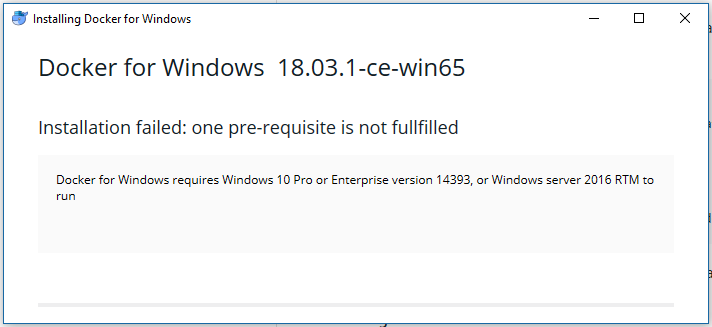
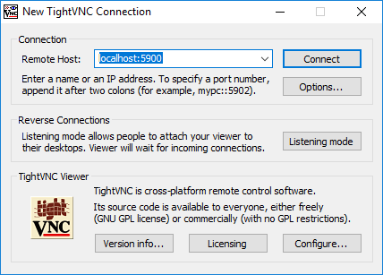
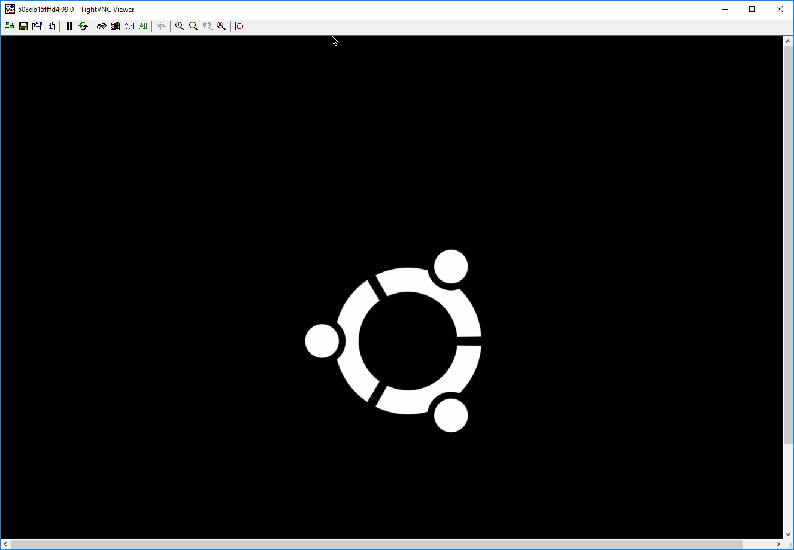
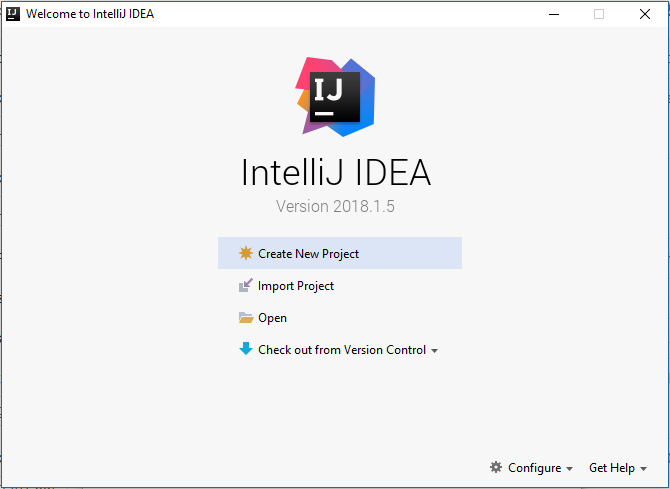
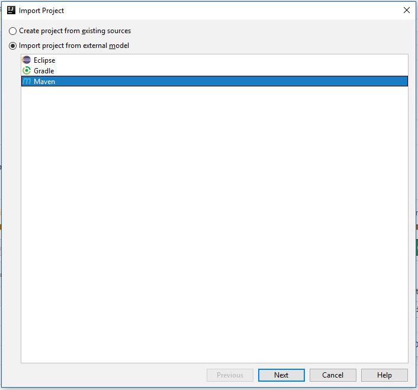
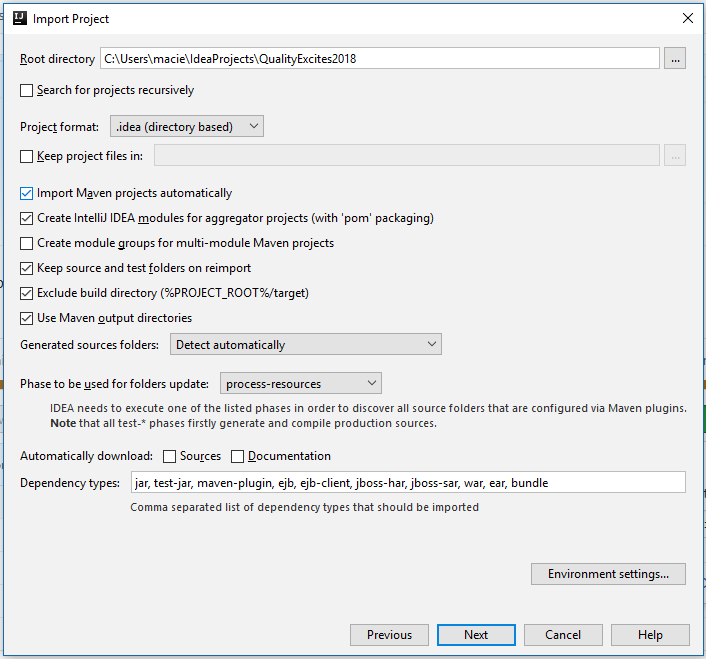

# ConSelenium 2019
Repository contains base project which will be used during workshops "From zero to hero - tests with Serenity framework".
# Environment setup
To be well prepared for the workshops there is need to setup environment in which we will be working. It's quite easy, but steps list might look a little bit scary. Don't worry, all will be described in details. In case of any problem you can email me - maciej.lorenc[at]gmail.com :) 
1. Install JDK
1. Install maven
1. Run selenium hub and node images (optional)
      1. Option with docker
            1. Install docker
            1. Install VNC viewer
      1. Option without docker
1. Install git (optional)
1. Install IntelliJ Idea
1. Import project from github
1. Add project as a maven project in IDE
1. Run sample test and check if it's working
#### Installing JDK
If you have JDK already installed you can skip this part, but please make sure that you have java 10 (if not, test probably won't run). You can do this bym opening cmd and typing ``java --version``:
```
λ java --version
java 10.0.1 2018-04-17
Java(TM) SE Runtime Environment 18.3 (build 10.0.1+10)
Java HotSpot(TM) 64-Bit Server VM 18.3 (build 10.0.1+10, mixed mode)
```
Please check number in the first line of response.

You can follow instructions from [this video](https://www.youtube.com/watch?v=74pE3kLerAU).
Link to installer download page - [click](https://www.oracle.com/technetwork/java/javase/downloads/java-archive-javase10-4425482.html).
## Installing maven
If you have maven already installed you can skip this part, but please make sure that you have at least maven 3.3.9. You can do this bym opening cmd and typing ``mvn --version``:
```
λ mvn --version
Apache Maven 3.5.3 (3383c37e1f9e9b3bc3df5050c29c8aff9f295297; 2018-02-24T20:49:05+01:00)
Maven home: C:\apache-maven-3.5.3\bin\..
Java version: 10.0.1, vendor: Oracle Corporation
Java home: C:\Program Files\Java\jdk-10.0.1
Default locale: pl_PL, platform encoding: Cp1250
OS name: "windows 10", version: "10.0", arch: "amd64", family: "windows"
```
You can follow instructions from [this video](https://www.youtube.com/watch?v=vUe4r9250c8).
Link to installer download page - [click](https://maven.apache.org/download.cgi).

## Run selenium hub and node images
For workshops I'll prepare environment which will allow to run tests remotely. But it will be added value if you configure it on your own. If you don't like to configure it on your onw pleas install TightVNC.
 
I highly recommend using option with docker (just because it's more comfortable and easy), but in some cases it's not possible to use it. This case occurs when you are not able to install docker which requires Windows 10 Pro. So my suggestion is just to try installing docker and then if something is wrong switching to second option. 
### Option with docker
#### Installing docker
We'll use docker to setup test run environment (selenium grid and node). Please follow [this instruction](https://docs.docker.com/docker-for-windows/install/#about-windows-containers).
If during installation you will see something like this:

#### Installing VNC viewer
If you are familiarized with any of VNC viewers please use your favorite one. If not I suggest to install [TightVNC](https://www.tightvnc.com/download.php). During installation choose to install only Viewer, we won't need a server.
#### Running selenium environment
Open command line (click start menu and type cmd) and run following commands:
```
docker network create grid
docker run -d -p 4444:4444 --net grid --restart=always --name selenium-hub selenium/hub:3.141.59
docker run -d -p 5900:5900 --net grid -e HUB_HOST=selenium-hub --shm-size 2g --restart=always --name selenium-node selenium/node-firefox-debug:3.141.59
```
If everything is ok you can try to connect via VNC to node. Use ``localhost::5900`` as address and ``secret`` as a password. If everything is ok you should see node's desktop.
Connection screen with TightVNC Viewer:


Node desktop:


You can also open in your browser [http://localhost:4444/grid/console](http://localhost:4444/grid/console), you should see something like this (but with one firefox instance available):


### Option without docker
You have to download Selenium jar using [this link](https://bit.ly/2TlkRyu). You can run selenium-hub now, by opening console in location when you downloaded file and running command:
```
java -jar selenium-server-standalone-3.141.59.jar -role hub
```
After that you should see something like this:
```
λ java -jar selenium-server-standalone-3.141.59.jar -role hub
21:02:22.188 INFO [GridLauncherV3.launch] - Selenium build info: version: '3.141.59', revision: '7c6e0b3'
21:02:22.203 INFO [GridLauncherV3$2.launch] - Launching Selenium Grid hub on port 4444
2018-06-17 21:02:22.859:INFO::main: Logging initialized @1831ms to org.seleniumhq.jetty9.util.log.StdErrLog
21:02:23.778 INFO [Hub.start] - Selenium Grid hub is up and running
21:02:23.782 INFO [Hub.start] - Nodes should register to http://10.103.65.14:4444/grid/register/
21:02:23.783 INFO [Hub.start] - Clients should connect to http://10.103.65.14:4444/wd/hub
```
You can also open [http://localhost:4444/grid/console](http://localhost:4444/grid/console) in your browser and you should see Selenium header.
Now it's time to configure and run node. To run test on the firefox you have to download and extract [gecko driver](https://github.com/mozilla/geckodriver/releases). Now you can run node passing path where you have extracted geckodriver:
```
java -Dwebdriver.gecko.driver="C:\geckodriver.exe" -jar selenium-server-standalone-3.141.59.jar -role node -hub http://localhost:4444/grid/register
```
You should see output like this:
```
λ java -Dwebdriver.gecko.driver="C:\geckodriver.exe" -jar selenium-server-standalone-3.141.59.jar -role node -hub http://localhost:4444/grid/register
21:28:19.458 INFO [GridLauncherV3.launch] - Selenium build info: version: '3.141.59', revision: '7c6e0b3'
21:28:19.530 INFO [GridLauncherV3$3.launch] - Launching a Selenium Grid node on port 34442
2018-06-17 21:28:20.649:INFO::main: Logging initialized @2406ms to org.seleniumhq.jetty9.util.log.StdErrLog
21:28:21.054 INFO [SeleniumServer.boot] - Selenium Server is up and running on port 34442
21:28:21.056 INFO [GridLauncherV3$3.launch] - Selenium Grid node is up and ready to register to the hub
21:28:21.289 INFO [SelfRegisteringRemote$1.run] - Starting auto registration thread. Will try to register every 5000 ms.
21:28:21.293 INFO [SelfRegisteringRemote.registerToHub] - Registering the node to the hub: http://localhost:4444/grid/register
WARNING: An illegal reflective access operation has occurred
WARNING: Illegal reflective access by org.openqa.selenium.json.BeanToJsonConverter (file:/C:/Users/mlo/Downloads/selenium-server-standalone-3.141.59.jar) to method sun.reflect.annotation.AnnotatedTypeFactory$AnnotatedTypeBaseImpl.getDeclaredAnnotations()
WARNING: Please consider reporting this to the maintainers of org.openqa.selenium.json.BeanToJsonConverter
WARNING: Use --illegal-access=warn to enable warnings of further illegal reflective access operations
WARNING: All illegal access operations will be denied in a future release
21:28:22.317 INFO [SelfRegisteringRemote.registerToHub] - Updating the node configuration from the hub
21:28:22.464 INFO [SelfRegisteringRemote.registerToHub] - The node is registered to the hub and ready to use
```
You can also open in your browser [http://localhost:4444/grid/console](http://localhost:4444/grid/console), you should see something like this:


## Installing git
Open [git download page](https://git-scm.com/downloads), download installer and run it. Follow installers instructions. If git is correctly installed then after putting ``git --version`` you should see something like this:
```
λ git --version
git version 2.17.1.windows.2
```
## Installing IntelliJ IDEA
Go to [download page](https://www.jetbrains.com/idea/download/#section=windows), select proper installer (choose Community version) and follow installer instructions.
## Importing and configuring project
Run IntelliJ IDEA. On home screen select ``Check out from version control`` and then select git:


When you will be asked for repository url add enter ``git@github.com:maclor/ConSelenium2019.git``, then clone repository. IDE will ask if you want to create project basing on the downloaded sources, accept this. You should see screen like this:


Please select options like on screenshot - iport project from external model and select maven. In next steps you will see screen like this one:



On this view please check _Import Maven project automatically_.
You will be also asked to select JDK. In this case you should to click green plus icon and select path where you have installed Java JDK.
When project import will be done, please open IntelliJ IDEA settings (if you don't know how - press _crtl+shift+a_ and type settings), then in the top left corner in search enter _maven_. You should see screen like this:


Please change _Maven home directory_ - click _..._ and select maven path (this one which you have installed).
When project is properly imported please click icon in bottom left corner and select _Maven projects_. On the right side _Maven projects_ menu will appear. Expand _lifecycle_ and double click _verify_. On the bottom of window terminal will appear. In this window you can track test progress. In VNC window you should be able to see running test. If you don't use docker then firefox window should appear. If test runs and reslt is ok, then you have configured everything properly :) Well done!

# Selenium grid servers
~~51.83.73.57:4444 vnc: 5900~~

51.83.73.57:4445 vnc: 5901

51.83.73.57:4446 vnc: 5902

51.83.73.57:4447 vnc: 5903

51.83.73.57:4448 vnc: 5904

51.83.73.57:4449 vnc: 5905

~~51.83.73.57:4450 vnc: 5906~~

51.83.73.57:4451 vnc: 5907

51.83.73.57:4452 vnc: 5908

51.83.73.57:4453 vnc: 5909

51.83.73.57:4454 vnc: 5910

51.83.73.57:4455 vnc: 5911

51.83.73.57:4456 vnc: 5912

# Lombok annotations processing in IntelliJ IDEA
Before Lombok installation you should enable annotation processing.
```
File -> Settings -> Build, Execution, Deployment -> Compiler -> Annotation Processors
File -> Other settings -> Default settings -> Build, Execution, Deployment -> Compiler -> Annotation Processors
```
Then install lombok plugin. If you have already installed plugin please reinstall it after enabling annotation processors.